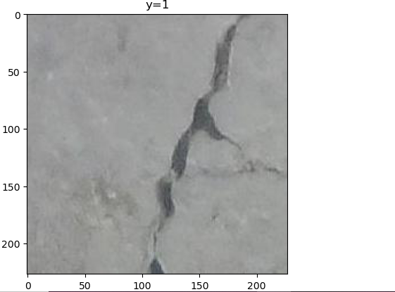

# Crack detection for structural health monitoring and inspection
We would like to train a model to detect Cracks, We will denote the images that contain cracks as positive and images with no cracks as negative.

1. [Download the data and study the dataset](https://github.com/Xhelo99/Crack-detection-for-structural-health-monitoring-and-inspection/blob/main/1%200_load_and_display_data.ipynb)
2. [Build a dataset object](https://github.com/Xhelo99/Crack-detection-for-structural-health-monitoring-and-inspection/blob/main/2%201_data_loader_PyTorch.ipynb)
3. [Use ResNet18 in PyTorch pre-trained model to classify between the negative and positive samples](https://github.com/Xhelo99/Crack-detection-for-structural-health-monitoring-and-inspection/blob/main/4%201_resnet18_PyTorch.ipynb)

  
  

